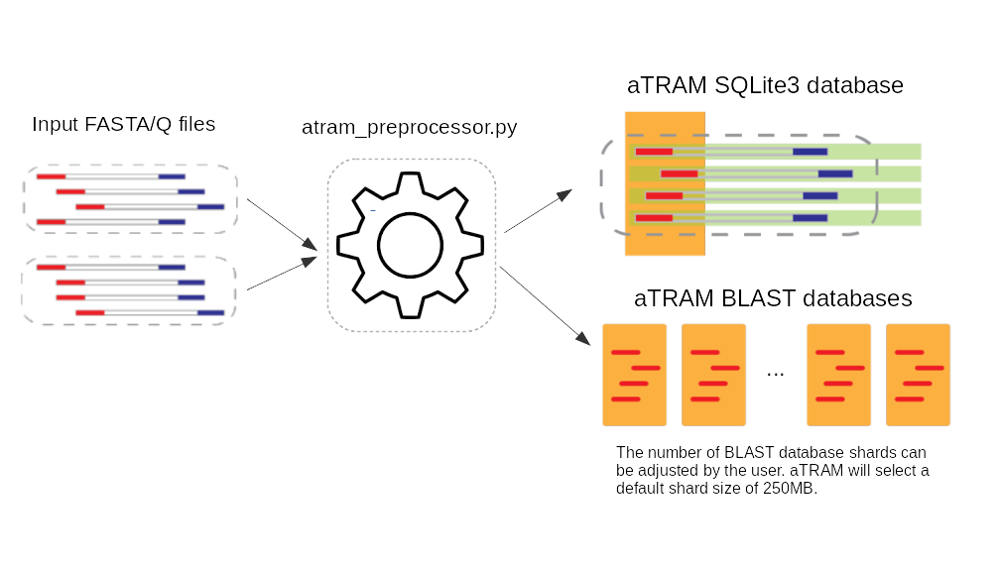

# A tutorial for atram_preprocessor.py

- [The input FASTA files](#The-input-FASTA-files)
- [Naming the database](#Naming-the-database)
- [Running the preprocessor](#Running-the-preprocessor)

This program reads a series of related FASTA or FASTQ files and builds an aTRAM
database. This aTRAM database is actually two or more databases
(typically several).

- An SQLite3 database that holds the contents of the FASTA/FASTQ files in a
format that can be easily and quickly queried. It takes three pieces of
information from the original files are: the sequence name, sequence end
(1, 2, or none), and the sequence itself.

- A set of BLAST databases. atram.py uses multiple BLAST databases. This
dataset division enables parallelized read queries and greatly improves
performance even for serial queries.



## The input FASTA files

We have provided some input files that we can use to practice using aTRAM in
the `doc/data` directory. For this tutorial, we will be using the
`tutorial_end_1.fasta.gz` and `tutorial_end_2.fasta.gz` files.

## Setting up a directory for the aTRAM databases

"Where do we want to store the built aTRAM databases?" I prefer to keep my
aTRAM built databases in their own directory on a large disk. So, I create a
`atram_db` directory and point aTRAM to that. In Linux Bash this looks like:

```bash
mkdir -p /path/to/atram_db
```

## Naming the database

The next question is, "What do we want to call our new databases?" Because the
input files are called `tutorial_end_1.fasta.gz` and `tutorial_end_2.fasta.gz`
I'm going to call the database `tutorial` but you may use whatever name you
want.

## Running the preprocessor

We now have everything we need to run the aTRAM preprocessor.
- Where we are storing the aTRAM databases (`/path/to/atram_db/`)
- What the name (prefix) of the aTRAM databases will be (`tutorial`)
- Where the FASTA files are stored (`/path/to/doc/data/`)
- What FASTA files are going to be used for input
`(tutorial_end_1.fasta.gz & tutorial_end_2.fasta.gz`)
- and the fact that the input FASTA files are gzipped

The command becomes:

```bash
./atram_preprocessor.py \
  --blast-db=/path/to/atram_db/tutorial \
  --end-1=/path/to/doc/data/tutorial_end_1.fasta.gz \
  --end-2=/path/to/doc/data/tutorial_end_2.fasta.gz \
  --gzip
```

When you run the command you should see atram_preprocessor log output that looks similar to:

```
2019-08-16 16:30:30 INFO: ################################################################################
2019-08-16 16:30:30 INFO: aTRAM version: v2.2.0
2019-08-16 16:30:30 INFO: Python version: 3.7.3 (default, Apr 3 2019, 05:39:12) [GCC 8.3.0]
2019-08-16 16:30:30 INFO: ./atram_preprocessor.py --blast-db=atram_db/tutorial --end-1=doc/data/tutorial_end_1.fasta.gz --end-2=doc/data/tutorial_end_2.fasta.gz --gzip
2019-08-16 16:30:30 INFO: Loading "doc/data/tutorial_end_1.fasta.gz" into sqlite database
2019-08-16 16:30:33 INFO: Loading "doc/data/tutorial_end_2.fasta.gz" into sqlite database
2019-08-16 16:30:36 INFO: Creating an index for the sequence table
2019-08-16 16:30:36 INFO: Assigning sequences to shards
2019-08-16 16:30:36 INFO: Making blast DBs
2019-08-16 16:30:56 INFO: Finished making blast all 1 DBs
```

There is some information about the aTRAM run-time environment. Following that,
we are noting when important events in the database build process happened.
Finally, we timestamp when aTRAM is finished. In this case the "Finished making
blast all 1 DBs" indicates that the size of the input FASTA files are small and
there is only one BLAST database shard needed. When you run this on larger
datasets there will be more.

## atram_preprocessor.py output

Let's look at what is created in the atram_db directory:
- A set of BLAST files starting `tutorial.001.*`. The '001' is the shard count.
- A log file `tutorial.atram_preprocessor.log`. This file contains more data
than the output to the screen and is useful for debugging problems.
- An SQLite3 database that contains the data from the FASTA files that atram.py
needs. The data in this database is tightly coupled to the BLAST databases so
if there is a need to edit your data you will need to rerun the preprocessor.

## Next

We are now ready to run atram itself. See the
[aTRAM tutorial](atram_tutorial.md).
